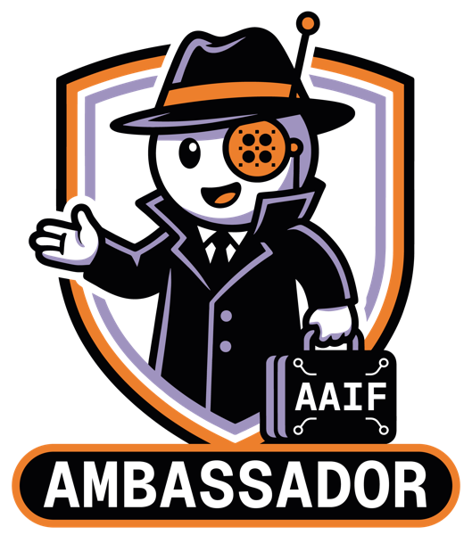

## CNCF & AAIF Ambassador  |  Cloud Native & AI Engineer

  

  

 

<picture>
  <source media="(prefers-color-scheme: dark)" srcset="./assets/aaif_ambassador_white.png">
  
</picture>

***
**Documents:** 
  - [KubernetesLab — K8s, Cloud Native & AI Research](https://kuberneteslab.dev/en/)
  
**Channels:**
  - [Linkedin](https://www.linkedin.com/in/hoonjo/)
  - [Github](https://github.com/sysnet4admin)
  - [Youtube](https://www.youtube.com/HoonJo) 
